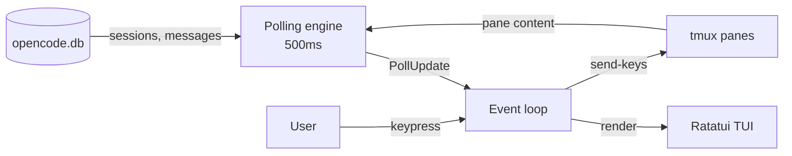

## The Problem

I run a lot of AI agents. On a busy day I might have eight or more OpenCode sessions going in separate tmux panes. Each one is working on something different with a slew of sub-agents of their own. Some are humming along. Some are stuck waiting for me to approve a tool call. Some crashed ten minutes ago and I haven't noticed. Some are hanging on waiting for a trickle of free usage because I overdid it with OpenAI, Anthropic, and Google models.

I cycle through each tmux pane, glance at the bottom of the terminal, figure out the state, move on. This stops working past three or four agents. By the time I check the last one, the first might be stuck again.

I wanted a single screen that showed me everything. A GUI was out. I'm already in the terminal. I don't want to context-switch to a browser so I built `occc` (OpenCode Command Center), a TUI in Rust using Ratatui. I built it with AI agents helping write it. Yes, I used AI agents to build a tool for monitoring AI agents. I'm aware of the recursion. There's something poetic about it.

## Architecture

The system pulls from two data sources and merges them into a single view. A polling engine grabs updates on a background thread, and the main event loop handles rendering and keyboard input.

The DB and tmux feed the polling engine, which pushes updates into the event loop. The event loop renders the TUI and can also send keystrokes back to tmux (for approving blocked agents).

## Two Data Sources

OpenCode stores all its session data in a local SQLite database. Messages, model info, tool calls, todos. It's a rich source of context for understanding what an agent has been doing.

But the DB has a blind spot. It doesn't reflect what's happening right now. If an agent is blocked on a permission prompt, the database still shows the last completed message. The session looks active when it's actually waiting...just waiting...

The fix: also read the tmux pane content with `tmux capture-pane`. The pane shows exactly what's on screen at this moment. It's the live view.

Combined, the DB gives gave me context (what happened) and the pane gives me state (what's happening now). Neither one is enough on its own.

## Async Polling

The TUI has to stay responsive. If the main thread blocks on a database query or waits for eight (or more) `tmux capture-pane` calls to finish, the UI freezes. That's not acceptable.

Polling runs on a background thread at 500ms intervals (configurable with `--poll-interval` and was good enough for me). It queries the DB, captures all the tmux panes, and sends a single update to the main thread through a channel. The main thread handles keyboard input and renders at ~60fps. It picks up new data whenever it arrives, but never waits for it.

I took this pattern from tmuxcc, one of three similar projects I studied before writing any code. The others were recon and ATM. Studying prior art before building saved me from a lot of wrong turns.

## Reading the Bottom of the Terminal

The hardest question was: how do you detect agent status without modifying OpenCode itself?

The answer is simple. Look at the last few lines of the terminal. OpenCode renders a status bar at the bottom of the pane. The status bar tells you everything.

If you see "esc interrupt", the agent is working. If you see "Confirm" and "Cancel", the agent is blocked on a permission prompt and needs your attention. If you see a `>` prompt, the agent is idle. This is brittle but it is simple and works at the moment.

The detection logic scans the bottom five non-empty lines of pane content, bottom-up. It's simple, reliable, and version-independent. It mirrors what I do manually, glance at the bottom of the terminal and read the status bar.

No structured event parsing. No hooks. Just text matching on five lines of terminal output.

## Using It

I keep `occc` running in its own tmux pane now. One glance tells me which agents need attention. I press `a` to approve a blocked agent without leaving the pane. It's a small tool that removed a real friction point from my workflow but it still needs to be refined.

Building it with AI agents was fitting. They wrote most of the boilerplate while I focused on the architecture and the polling design.
