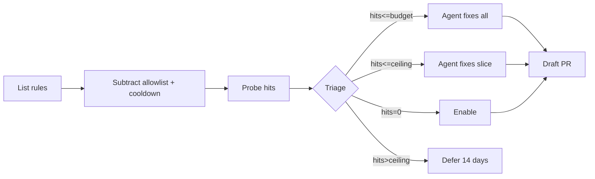

## The Problem

There's a class of bugs my codebase's lint stack does not see. `if (x) { ... } else if (x) { ... }`. `a && a`. `arr.length < 0`. `.indexOf(x) > 0` silently missing index 0. `[10, 2, 1].sort()` sorting alphabetically. TypeScript types check out. The existing rules pass them through. They land in PRs and sit there until someone notices the symptom in production.

There is a lint plugin that catches every one of these. Adopting it the obvious way (turn on the `recommended` preset) lights up roughly two hundred violations across the repo on day one. Every PR starts failing on unrelated code. The team disables the new plugin within a week. We've all watched that movie.

The interesting question is not "should we adopt strict linting." It's "how do we adopt it without poisoning the well."

## The Allowlist Contract

Instead of pulling in a preset and then negotiating exceptions out of it, I inverted the default. The plugin is loaded, but the `rules` object only lists what we have explicitly opted into. Every enabled rule is `error`. There is no `warn` parking lot, because a parking lot contradicts the whole point.

The contract is one sentence:

> CI cannot fail on a rule we haven't explicitly enabled.

That's not a config style. It's a guarantee. The lint surface is now a list of strings in one file, and that list is the entire definition of what we lint for.

The seed was thirty-five rules, hand-picked across four bug shapes the existing stack misses:

1. **Semantic equivalence bugs**: `a === a`, duplicate `else if` branches, identical successive expressions.
2. **Numeric and collection footguns**: off-by-one on `indexOf`, impossible-length comparisons, default sort order applied to numbers.
3. **Always-this-way expressions**: branches guaranteed truthy or falsy, generators with no `yield`, functions that always return the same value.
4. **Redundant JSX**: `{value && value}`, double-guarded conditionals, identical sibling expressions.

Probing across the working code surface produced eight real cleanups the existing stack had passed. Dead branches, redundant guards, a reducer that should have been a `filter().map()`, a couple of interface-naming inconsistencies. Roughly thirty-five new rules of coverage cost about thirty-eight lines of code in cleanup.

The two most interesting decisions:

- **Five-hit budget per rule.** A new rule is allowed in only if the entire codebase has five or fewer existing violations. Either fix them in the same PR or inline-disable with a reason. If the hit count is higher, the rule does not ship in the seed.
- **Inline disables require a reason.** Not because reviewers parse the reason carefully, but because writing the reason forces you to articulate why the pattern is intentional rather than just suppressing the warning.

## Allowlist vs Baseline Ratchet

The first instinct of every "we'll fix it gradually" linting effort is the baseline-ratchet pattern: turn the preset on, freeze the existing violations in a baseline file, and only fail on new ones. It's a real pattern with real tools. It works.

It also has two failure modes I wanted to avoid.

First, the baseline file rots. Someone touches a line that happens to be one of the frozen violations, and now they're suddenly responsible for cleaning up something unrelated to their change. They either do an out-of-scope cleanup, or they update the baseline to suppress it again, which silently grows the debt.

Second, the baseline file is unreadable. It's a JSON dump of file paths and rule names. It doesn't tell you what your lint coverage is. It tells you what it isn't, in a format nobody reads.

The allowlist is the inverse. It is a short, readable, alphabetized list of every rule the codebase has committed to. You can read it in thirty seconds. You can audit it. You can decide whether a rule belongs.

The cost is real. Adding a rule means doing the work, not deferring it. That cost is also the feature. Code I'm not willing to clean up is code I'm not willing to lint for.

## The Auto-Enable Bot

A static allowlist of thirty-five rules is a starting point, not an end state. The plugin has roughly four hundred rules. Some of those four hundred are noise for this codebase. Some are real bugs waiting to be caught.

The question is which ones, and the honest answer is "you find out by trying." So I gave that loop to a daily scheduled agent.

The bot runs once a day. Every run it does five things:

1. **Enumerate candidates.** Read every rule the plugin exports. Subtract what's already in the allowlist. Subtract anything in the cooldown bucket (rules previously deferred get a two-week resting period).
2. **Probe hits.** Run lint once across the codebase with all candidates enabled. Count violations per rule.
3. **Triage by hit count.**
   - Hits ≤ budget: an AI agent fixes every hit, and the rule joins the allowlist.
   - Budget < hits ≤ ceiling: the agent fixes a budget-sized slice. The fixes ship, but the rule does not get added to the allowlist yet. It stays in "in progress" until future runs grind the count to zero, at which point it graduates.
   - Hits > ceiling, or the rule crashes lint entirely: deferred for two weeks.
4. **Open a draft PR.** Code changes for the run, plus an updated allowlist entry if the rule fully graduated.
5. **Update tracking state.** Each run's state lives in a single tracking issue's body. Durable state (what's enabled, what's deferred, what's in progress) lives in the allowlist file itself with structured comment blocks.

The interesting tunables are the budget and the ceiling. Budget is "how much work am I willing to ask the agent to do in one PR." Ceiling is "how many hits is too many for AI-driven fixes to be trustworthy." Both are repository variables so they can be turned down without code changes.

## Safety Rails

An agent with file-write access to the working tree and a daily schedule is a small risk surface that needs two specific guardrails.

**Strip tokens before invoking the agent.** Right before the agent step runs, the workflow runs `unset GH_TOKEN GITHUB_TOKEN ACTIONS_RUNTIME_TOKEN ACTIONS_ID_TOKEN_REQUEST_TOKEN`. A prompt-injected agent that decides it would like to push code, comment on PRs, or read other secrets via the Actions runtime simply has nothing to authenticate with. The agent can write files, and that's it.

**Path allowlist before commit.** Before the workflow stages anything for commit, it runs `git status --porcelain` and refuses to proceed if anything outside the agreed paths (source directories plus the allowlist file) has been modified or created. Staging is then explicit: `git add <path>` per file, not `git add -A`. Even if the path check were somehow bypassed, off-target changes still wouldn't enter the commit.

Together these mean the worst plausible outcome is "the agent introduces a bad fix to a file in scope, the draft PR opens, the human reviewer catches it." It cannot self-modify the workflow file, the prompts, or any infrastructure. The blast radius is exactly the size of the agent's job.

## What This Is Really About

This is the same shape as [the human-in-the-middle code review loop](/blog/self-improving-code-review): the bot proposes, the human disposes. The agent's job is to do the grunt work (probe, classify, fix, draft). The human's job is to decide whether the proposed change belongs.

The pattern I keep coming back to: probabilistic systems need deterministic scaffolding. The agent's fix to a specific rule violation is probabilistic. The list of paths it can touch, the budget on how many hits per run, the cooldown that prevents the same crashing rule from being probed forever: those are all deterministic. The deterministic parts are what keep the probabilistic parts from drifting into each other's lanes.

The lint ratchet is a small instance of a bigger idea. Build the boring deterministic structure first. Then let an agent operate inside it.

## What's Next

A few things I want this loop to grow into, generalized away from any specific plugin:

- **Cross-plugin overlap detection.** When a new rule fires on patterns that an existing rule already catches, the bot should flag the overlap and recommend disabling one of them. Today this is a manual review step.
- **Auto-deprecate.** If a rule has been in "in progress" with zero hits across N consecutive runs, graduate it automatically. The current pipeline needs a human to confirm the transition.
- **Pattern-driven rule discovery.** When the human-correction backlog from the code review bot keeps surfacing the same shape of bug, the bot should propose a candidate rule (or candidate plugin) that would catch that shape. Right now humans seed candidates by reading the docs.
- **The same shape for other automated checks.** Type checking and dependency policy both have the same "preset is too noisy, manual rules are too slow" failure mode. The allowlist + daily ratchet generalizes.

What I'm certain of: a static allowlist is not the goal. A growing, self-curating allowlist is. The agent's job is to make growth cheap. The human's job is to make sure the things being added are actually worth adding.

## The Honest Part

A daily agent that opens draft PRs is a thing that can produce bad PRs. It does. Some of them are wrong about whether a violation is real. Some of them propose fixes that are technically correct but change behavior in subtle ways. The agent's reasoning, when it gets things wrong, often looks plausible.

The reason this is okay is the same reason any human-in-the-loop pipeline is okay: nothing reaches the codebase without a human reviewing the proposed change. The agent's output is a draft PR, not a merged commit. The probabilistic part proposes. The deterministic part (a human looking at the diff) disposes.

I am not solving "AI writes correct code." I am solving "AI does the tedious mechanical work of moving the quality bar up, one rule at a time, with a human watching." That is a much smaller problem, and one that turns out to actually work.
