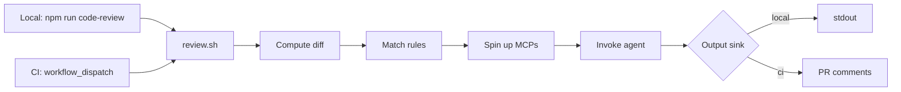

## The Problem

The AI code reviewer in my repo runs on every PR. It reads a set of rules, looks at the diff, and posts inline comments. When it works well, it surfaces things a human reviewer would have flagged eventually. When it works badly, it surfaces things the human reviewer has to push back on, which feeds the [self-improving loop](/blog/self-improving-code-review) that updates the rules.

There is a third state, the one that quietly burns the most time. The bot is right, and you would have happily fixed the issue before opening the PR if you had known. You open the PR, the bot comments, you fix, you push, you wait for the next bot run. Maybe there are nitpicks you also want to address. Maybe the new commit introduces a new pattern the bot catches. Each loop is small, but they stack up, and the PR's review thread fills with bot-only conversations that drown out the human comments.

The fix is obvious in retrospect: stop waiting for the PR. Let me run the same review locally, against my working tree, before I push anything.

## One Code Path For Two Contexts

The temptation is to write a second, simpler local version. "It's just for developers, we don't need everything the CI bot does." That fork rots the day after it ships, because every change to the CI bot has to be mirrored manually into the local version, or the two drift and developers stop trusting the local one. I've seen this pattern fail in three different repos.

So the design constraint was different: one code path, two invocations.

The review logic lives in a shell script. The script knows how to:

1. Compute the diff against the target branch.
2. Match the changed files against the rule files (rules have glob and description-based selection).
3. Spin up whatever supporting services the review needs (the MCPs the agent calls, the API specs it validates against, the ticket system it looks up acceptance criteria from).
4. Invoke the AI agent with the matched rules, the diff, and the supporting context.
5. Stream the agent's findings somewhere.

CI calls the script. The local command calls the script. The only difference is the value of one environment variable: where to write the findings. CI posts them as PR comments. Local prints them to stdout.

The script does not care which context it is in. It is the same one piece of code, exercised by both invocations every time.

One implication: when CI breaks, you can almost always reproduce the break locally. When local breaks, you can almost always reproduce it in CI. That mutual-reproduction property is the single best test for whether your "shared logic" is actually shared.

## Why The Locally-Run Review Is Different

You might ask: if the local mode prints to stdout, why bother? Just push and read the comments.

A few reasons that compound:

- **The feedback is in your terminal, not in your inbox.** No context switch. No half-formed PR description waiting in the background. You are still in your editor with your changes loaded.
- **It runs against your working tree.** No commit needed. You can iterate within a single change before deciding whether the change is even worth committing.
- **You can scope it.** Run only the rules that match the files you just touched. The local script can take flags the CI bot doesn't need.
- **You learn what the bot will say without committing socially to a PR.** A PR is a request for review. Once it's open, both humans and the bot are looking. Opening a PR to find out whether it's any good is a tax you pay on every other reviewer's time.

The compound effect is that the local mode becomes a real iteration loop. Write code, run the review, fix the easy things the bot would have caught, run again, push. By the time the PR opens, the bot's comments (if any) are the interesting ones: actual disagreements, not low-effort nits.

## Killing The Dead Loop

The corollary to "more local review" is "less automation noise on the PR." I went looking for any workflows that had become redundant or silently broken.

One had been dead for two weeks. It was a workflow that listened for the bot's review comments, fed them into a rule-update pipeline, and opened a fix PR. It had run fifty times since deployment and concluded "skipped" on every single run. The reason was a webhook event-type mismatch: the workflow listened for `pull_request_review`, but the bot's findings arrive as `issue_comment`. The workflow had never matched, and humans were flipping the feedback PRs out of draft before its expected trigger could fire anyway.

I deleted it. The workflow file, the label conventions it depended on, the comment markers it would have written. None of it had any callers.

I had to triple-check there were no callers, because deleting workflow files is one of those changes where being wrong is silently embarrassing. The check was easy: grep for the file name, the labels, the comment markers, the workflow ID. Zero hits outside the file itself. Gone.

The lesson here is one I keep relearning. Once an automation is in place, nobody removes it. They route around it. The cost of a dead workflow is small individually and large in aggregate: every developer who sees the label on a PR has to wonder whether it matters, every CI run pays the tiny cost of evaluating its conditions, every grep through the workflows directory has more noise.

If an automation has been silently no-op for weeks, it is not idle. It is rot. Delete it.

## Composition Of The AI Review Surface

This is the third post in a sequence about the same code review bot. Each post is a different cut at the same problem:

- [Teaching the Bot to Take Notes](/blog/self-improving-code-review) is about the feedback loop that turns human corrections into rule updates.
- [The Bot Gets a Second, Third, and Fourth Opinion](/blog/second-third-and-fourth-opinion) is about splitting the rule-update synthesis from one LLM call into four staged calls.
- This one is about pushing the bot earlier in the pipeline so PRs are not the first place it runs.

The combined picture, when I squint:

- The bot's job is to review code.
- Humans correct it when it's wrong.
- A separate four-stage pipeline turns those corrections into rule updates, with a human gate before anything merges.
- Developers run the bot locally before they push, so the PR is a place for real review, not for resolving the things the bot would have caught anyway.

Each piece is small. Together they form something I would call a "code review surface" rather than a "code review bot." The bot is one component. The harness around it is the rest.

## What's Next

A few directions I want this to grow:

- **Smarter rule matching.** Today the script matches rules by glob and description against changed files. A natural extension is to match by content: rules that target a specific pattern only invoke the agent when that pattern is plausibly in the diff. Less work per run, faster local feedback.
- **Pre-commit, optionally.** Local review is fast enough that a strict version could live in a pre-commit hook. I'm intentionally not pushing this yet, because forced pre-commit hooks tend to corrode developer trust faster than they save bugs. Opt-in first. Default later.
- **Streaming partial output.** The agent today emits all findings at the end. Streaming them as it produces them would shorten the perceived loop noticeably, even when total time is the same.
- **Bot's own bot.** Run the local code-review bot on changes to the code-review bot itself. Same review for everyone, including the reviewer's own commits.

## The Honest Part

Local review is only as good as the rules behind it. The script will obediently run the agent with whatever rules exist. If the rules are bad, the local feedback is bad. If the rules are stale, the local feedback is stale. The local mode does not fix bad rules; the [self-improving loop](/blog/self-improving-code-review) does that. The local mode just makes sure the rules are exercised earlier, more often, and against your working tree instead of against a frozen PR snapshot.

The other honest part: developers will sometimes ignore local review. It is not a gate. Nothing forces them to run it. The hope is that the friction of opening a PR to find out it has nitpickable issues is high enough, and the friction of running a local command is low enough, that the easy thing becomes the default thing. Time will tell.

What I do know is that one code path for both contexts is the right shape. The split-personality version, the "lite" local fork, is the failure mode I have seen too many times. Same script. Same rules. Same model. The only difference is where the answer lands.
