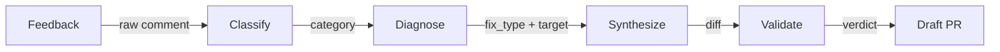

## The Problem

Last month [I wrote about a bot that took notes on itself](/blog/self-improving-code-review), where human corrections to AI code reviews feed back into the review rules through a scheduled pipeline. Capture, process, merge. A human approves every rule change. The loop worked.

Then the bot wrote a bug into its own PR.

The job was supposed to synthesize a backlog of feedback into rule updates. The synthesis was one LLM call reading the backlog, picking which file to edit, and writing the edit. On this particular run it produced a rule about `rgb()` color usage and dropped it into the review prompt file instead of the styling rules file. The review prompt now had duplicate rules that contradicted each other on severity. Merged, it would have poisoned every future review.

The fix was not a better prompt. The structure of the work was the problem. One LLM was doing four jobs: classifying each piece of feedback, diagnosing a root cause, picking a target file, and authoring an edit. Any one of those is fine to ask an LLM for. Asking for all four in a single pass is how you get an `rgb()` rule in the wrong file.

## Why One Bot Failed

The failure wasn't "the model made a mistake." The failure was that nothing downstream could catch it. The synthesizer's output was a diff. Diffs are structurally valid by definition. There's no schema to violate when you pick the wrong filename. It's just a string. By the time a human saw the draft PR, the wrong-file decision was baked into the diff, sitting alongside rule-wording changes that looked fine on their own. Reviewing a mixed-concern diff is exactly the kind of thing humans skim.

Asking one model to do four jobs means the model gets to quietly decide the boundaries between them. It also means there's no stage where a different model, with fresh context, can ask "wait, should this rule really be in that file?"

## The Four Stages

The new pipeline splits the one call into four, with a constrained artifact on every handoff.

**Classify** labels each feedback item as a false negative, false positive, or something to discard. It doesn't propose fixes. Its only output is an enum.

**Diagnose** reads the classified items, greps the existing rules, and picks a `fix_type` from a fixed list: narrow the glob, rewrite the description, edit the body, defer, or discard. It also picks the target file. File selection happens here, once, with the whole picture in view, instead of as a side effect of writing an edit.

**Synthesize** does the wording. It's the only stage that produces a diff, and it can only edit the file the diagnose stage picked, using the `fix_type` the diagnose stage chose. It can't decide it would rather touch a different file. That option isn't in its input.

**Validate** takes the finished diff into a fresh context and checks it against the existing rules for contradictions, scope issues, and audience mismatches. It emits one of three verdicts. Pass moves on. Revise or reject reverts the change and leaves an @-mention for a human to take a look.

The shared enum vocabulary for all four stages lives in a single YAML file, so the `jq` that glues the stages together and the prompts the stages run are guaranteed to agree about what a `fix_type` can be.

## Constraints as Contract

Every arrow in that diagram is a contract. The contract isn't "be careful"; it's "you literally can't emit anything outside this shape." A classify stage that tries to propose a fix has no field to put it in. A synthesize stage that tries to edit a prompt file gets reverted. The modifiable scope is now enforced by directory, not by a growing exclusion list. `.cursor/rules/` is writable. `.github/prompts/` is not. The filesystem is the type system.

The original loop had one gate: a human at the end of the pipeline approving a finished diff. The new one has a gate between every pair of stages, and most of them don't need a human. They're shaped like `jq` checks, enum matches, and directory membership tests. The human only sees the final PR, but by the time it gets there, the artifact has been narrowed four times.

This is the same Human in the Middle idea from the original loop, just pushed upstream. Human review is still the safety system. The difference is what the system is protecting: before, a human was the only thing between a bad synthesis and main. Now, a human is the last thing between a bad synthesis and main, but each earlier stage has already made it harder for the previous stage's mistakes to reach them.

## The Honest Part

Four stages is not four guarantees. It's four chances for a bad call, and I've spread risk rather than eliminated it. Classify can mislabel. Diagnose can pick the wrong file. Synthesize can write the wrong words into the right file. Validate can approve a change that looks internally consistent but is still wrong for the codebase.

What changed is the shape of what can go wrong. The parts of the pipeline that have to be deterministic (the enum vocabulary, the directory allowlist, the `jq` that assembles the PR body from JSON state files) are deterministic. The parts that can't be, because they involve judgment on natural-language feedback, are probabilistic. The deterministic scaffolding is what keeps the probabilistic pieces from drifting into each other's lanes.

Probabilistic systems don't get you guarantees. Deterministic structure around them gets you shape. Shape is the thing you can test, revert, and reason about. The LLM is still the LLM. What's new is that the LLM now has to speak through a grammar that the next stage, and eventually a human, can actually parse.
