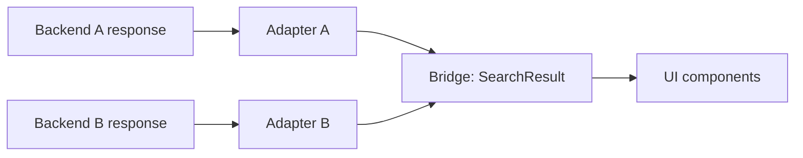

## The Problem

The search experience in my codebase had grown around a single search-as-a-service vendor. That vendor was great for years. Then the requirements outgrew it: we wanted server-side personalization, server-owned ranking signals, and analytics emitted from the backend rather than from every client.

Switching the engine is a backend project. Switching how every component reads the result is a frontend project. The frontend containing the old vendor's types had quietly leaked everywhere. `objectID`, `_highlightResult`, `PairingResult`, vendor-shaped facet objects: all of those names appeared in components, hooks, and analytics events. The UI was not coupled to "search." It was coupled to a specific search service.

To swap the engine without rewriting the UI, I needed two things. A type contract the UI could trust regardless of who answered, and a place to put the per-backend translation that did not require the UI to know that place existed.

## Bridge and Adapter

I borrowed two old words.

**The Bridge** is the type contract. It is the shape of data the UI expects, and it has no vendor specifics. `SearchResult`, `InventoryStatus`, `Restriction`, plain fields with plain types. The components import these. They do not import anything else search-related.

**The Adapter** is the mapping function. One adapter per backend. Its job is to take a backend-specific response and produce the Bridge type. Each adapter is responsible for the parts of the response that only it knows about: which field is the ID, where the ranking signals live, what the inventory state means in this backend's vocabulary.

The pipeline that produces a Bridge value is also per-backend, because the shape of the work differs. The old backend needed three parallel queries (results, facets, autocomplete) merged into one result set. The new backend needed a single query that returned IDs, followed by a hydration call to fetch the entities by ID, followed by a tags call if restrictions surfaced. Same Bridge output, very different work.

The most important decision was where to put the Bridge boundary. The first instinct is to put it at the individual query level: every raw query result returns a Bridge type already. That sounds cleaner, but it forces every backend to fake a shape it doesn't naturally have. The right place is at the pipeline output, where each backend gets to do its work in its own shape and only commits to the Bridge type at the very end.

A few rules that turned out to matter:

- **Inventory state computes inside the adapter.** It depends on backend response fields. Pushing it to a downstream component would force the component to know which backend was upstream.
- **Highlighting belongs in the adapter.** "What got matched" is a per-backend concern. A neutral `MatchSpan[]` on the Bridge gives the UI a uniform thing to render without caring about how the match was determined.
- **Popular and recent queries pre-fetch independently.** They don't belong inside the search pipeline at all. Wiring them through it forced the dropdown's empty state and the live results state into the same loading lifecycle, which mishandled the mobile case where the dropdown opens before any query is typed.

## Running Both Backends At Once

A migration like this is only safe if you can run the new backend behind a flag and compare it to the old one in production traffic. I gated the new path on an experiment, and ran both arms in parallel for weeks.

Two things made this work better than I expected.

**Just-in-time enrollment.** The naive thing is to enroll every user at app boot, which assigns a variant whether or not the user is going to interact with search. That pollutes the experiment with people who never trigger the feature, and it forces the variant assignment to happen in a code path that runs for every page load. I moved enrollment to the first time a user opens the search dropdown. A POST to an enrollment endpoint returns the variant. The result is read on subsequent search interactions. If the endpoint is slow or fails, the search falls back to the control arm for that open and tries again next time. Nobody is blocked.

**A timeout safety net.** Enrollment uses a two-second client timeout. If the network is bad, the page is loading, anything goes wrong: control arm. The fast path is the path that always works.

The trade-off here is real. JIT enrollment means the variant assignment has to happen client-side. That introduces a small race window where a user can open the dropdown, get assigned, and then start typing in less time than the assignment round-trip takes. The fallback (treat as control) covers it, and the cost is small (one search interaction in the wrong arm, attributed by the search ID below).

## The Shared Search ID

This was the piece I underestimated.

Search analytics is a graph problem. A user types a query, sees results, scrolls, clicks, lands on a detail page, maybe converts. To attribute the conversion back to the search, every event has to carry an identifier that anchors it to the original query.

The old backend minted a search ID server-side and threaded it through its own response. The new backend does the same, in a different shape, with different field names. Either approach works in isolation, but neither works for "compare the two arms on the same dashboards."

I moved the ID generation to the client. A UUID is minted per query, attached to the request, and propagated as `X-Search-Id` and `X-Feature` headers on every request to the search endpoint. The same ID appears in every analytics event downstream of that query: result interaction, detail-page view, share, conversion. The backend can emit its own events using the same ID, so frontend and backend analytics line up on the same key.

A few subtleties:

- **The ID is anchored to the search session, not the click.** Pagination, infinite scroll, tab switching within the same query all keep the same ID. A new query mints a new ID.
- **The ID is generated even when the new backend isn't serving.** Control arm requests carry it too. Otherwise the comparison would be biased: the new arm has rich attribution and the old arm doesn't.
- **Duplicate-event prevention has to live somewhere.** Once the backend started emitting `Search Executed` on behalf of users in the new arm, the client had to stop emitting the same event for those users, or the event would double in the analytics warehouse. The client gates that emission on the experiment variant.

## Verifying Parity

Two arms running at once is a parity-verification problem. The contract I wanted: for any user, on any query, the visible output of the new arm matches the old arm on every dimension that matters.

I drew up a checklist and ran it manually on real accounts in the staging environment, then on the QA preview, then on production behind the flag.

- Search a generic term on both tabs. Result counts comparable, result content overlaps heavily.
- Search a term with restriction-relevant matches. Restriction badges identical in copy. The display strings are produced by the same lookup table in both arms, so any divergence here would mean the adapter put the wrong key on the Bridge.
- Out-of-stock and coming-soon badges identical in both arms. These flow through a single decoration step downstream of the bridge merge.
- Click attribution carries the search ID identically. Same event name, same prop shape, same anchored ID.
- Tab switch with an active query. Both arms re-fire with the new index. Both render results with the same overall structure.
- Empty results. Both arms render the empty state with popular suggestions populated.
- Failure paths. Network failures on either arm fall back cleanly. No "Whoops!" error boundaries.

The exercise turned up a handful of real bugs in the new arm's adapter (a field that was nullable in one shape and not the other, a coming-soon flag that needed to be resolved against a separate dynamic config). The contract made each one easy to spot: the failing output was structurally different from the control arm's output, and the only thing between the backend and the UI that could be wrong was the adapter.

## What This Pattern Generalizes To

The Bridge plus per-backend adapter is not a search-specific idea. It applies anywhere the UI talks to a service that you might want to swap, or run two of, or rebuild.

Three properties that make the pattern worth its weight:

1. **The UI only imports neutral types.** The day you decide to swap backends, the work is bounded by the adapter, not by the surface area of the UI.
2. **The pipeline is per-backend, but the contract is shared.** Each backend gets to be honest about the work it actually does. The common shape lives only at the output.
3. **Side concerns live in the adapter.** Inventory, ranking, highlighting, anything backend-specific. The components see a single uniform answer.

It also raises the bar for analytics. If your events are tied to a specific backend's identifiers, you cannot run two backends side by side and compare them. Decouple the identifier from the backend (mint it at the client, mint it at a gateway, mint it anywhere that does not depend on which backend served the request) and the comparison becomes mechanical.

## What's Next

This migration is still in flight. The new backend is ramping behind an experiment. Once the ramp completes and confidence is full, the old adapter and the old pipeline are gone. The Bridge stays. That's the entire point: the contract outlives the backends.

A few things I want to apply the same shape to next:

- **A shared identifier across more than one feature.** The search ID anchors search-attributed events. The same idea generalizes to any user action that has downstream events: filter sessions, recommendation impressions, anything where attribution has to span a sequence of interactions.
- **Adapter-level contract tests.** Today parity is verified by running both arms and looking at the output. A better world has typed contract tests that diff a Bridge value produced by Adapter A against one produced by Adapter B for the same logical query. Hard to do for ranked results, easier to do for structural fields.
- **A "shadow" mode for new backends.** Run the new backend in parallel with the old one and return the old one's results to the UI, but emit comparison metrics in the background. The Bridge gives this for free: two pipelines, one Bridge output to compare against the other.

## The Honest Part

The Bridge does not eliminate coupling. It moves it. The old coupling was everywhere. The new coupling is the Bridge type itself, and the Bridge type evolves: new fields get added, old fields get nullable, the adapter for each backend has to keep up.

What the pattern buys is not zero work. It is bounded work. When the Bridge changes, you know exactly which files need to change. When a backend changes, you know exactly which file (one) needs to change. When you want to add a backend, you know exactly which file (one) needs to be written.

Boundedness is the entire game. Most refactors fail because the work is unbounded. The Bridge is a way to bound the work in advance, and to keep it bounded for the next backend, and the one after that.
